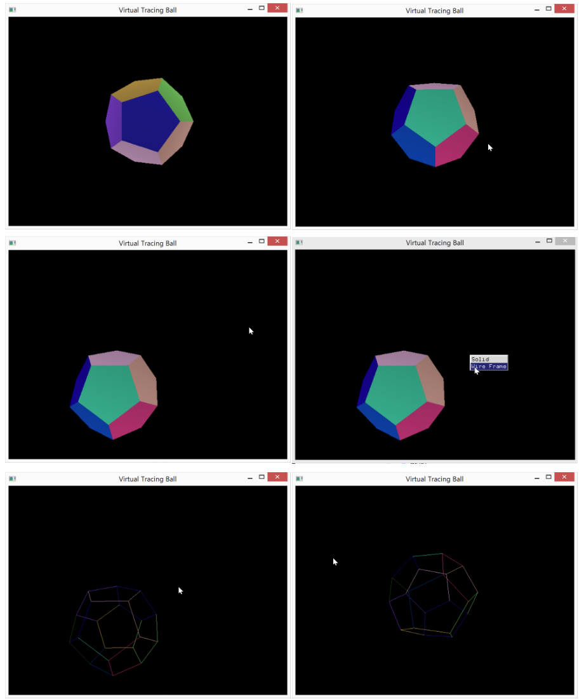

# Virtual Tracing Ball

Zhang Qiuyi, 12330402

## Dependencies
* freeglut(local library, included in the project)
* OpenGL and GLU

## What is it?
A colorful dodecahedron that can be manipulated(rotated/tranlsated) with the mouse.

.

### Operations
* Drag with the left button of the mouse to rotate the dodecahedron.
* Drag with the right button of the mouse to translate the dodecahedron.
* Hit the middle button of the mouse to choose how will the dodecahedron be displayed(solid or wireframe)
* Hit the `F` key to toggle fullscreen mode
* Hit the `esc` key to exit

## File structure

```
  - doc  // report goes here
  - data // .off data file goes here
  - include  // header files
  - lib  // static libraries
  - obj  // intermidiate obj files
  - src  // source code

  - freeglut.dll  // dynamic library for prebuilt executable
  - TracingBall.sln   // premaked VS2012 project file
  - main.exe  // prebuilt executable
  - premake5.lua  // premake5 script
  - preview.png   // preview of this demo
  - README.md   // you are reading it :)
```

## About the executable

The executable is built with MinGW, the necessary libraries are all bundled inside this project. Just run `main.exe` to see the drawing.

## How to build it?

You can build it with VS2012 or above, Make and MinGW, or fallback to anything that premake5 supports(VS2005 and above).

You don't need to copy any file to any location. All libraries files(.h, .lib and .dll) are locally included. Note that it is the libraries under `include` and `lib` that will actually get linked, not your global libraries.

### VS2012 or above

Open the `TracingBall.sln` with VS and build the main target.

If you are using VS2013, it will ask you to migrate the project, just click OK.

### Make and MinGW

If you are running it under windows, you need to install MinGW and make. Checkout [my blog post](http://www.cnblogs.com/joyeecheung/p/4310487.html) if you want to know how to setup the environment.

After installing MinGW and make, go to the root of this project under cmd, and run `Make`. 

### premake

If none of the above works, download premake5 from [here](https://premake.github.io/download.html#v5), extract the executable in the archive(e.g. premake5.exe), and put the path to the executable in your `PATH` environment variables. Then open cmd and run `premake5 --help` to see what project files you can generate. I've written a premake script to generate the proper project files.

It should support VS2005 and above. For example, to generate the project files for VS2012, simply run `premake5 vs2012`, then open `hw3.sln` with your VS and build the main target.

## About

* Author: Joyee Cheung
* [Email](mailto://joyeec9h3@gmail.com)
* [GitHub Repo](https://github.com/joyeecheung/SE-342-Computer-Graphics/tree/master/hw3)
