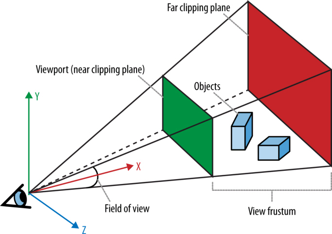

## What are WebGL, CSS3 3D, Canvas?
* WebGL is a set of **API exposed by browsers**, basically it's just **OpenGL ES with JS as interfacing language**. It is for **hardware-accelerated 3D rendering with JS**.
    Check this out: [How WebGL works?](http://stackoverflow.com/questions/7328472/how-webgl-works)
* CSS3 3D is a set of **3D-related features provided by CSS3**(transition, transform, custom filters, etc.). Nowadays many browsers provide hardware-acceleration for it.
* Canvas is a **2D drawing context API**, specified in the HTML standard. It has a much wider support than the two above. Since in computer graphics, 3D is based on 2D ([Rasterisation](http://en.wikipedia.org/wiki/Rasterisation)), canvas can also be used to render 3D effects.

## Interestingly...

WebGL is not controlled by W3C, but by the Khronos Group who also controls OpenGL.

WebGL uses the same **coordinate system** as OpenGL, different from the one used by CSS and Canvas.

## Mesh, polygons, vertices

Used to draw 3D graphics, object composed of **polygonal shapes**, constructed out of **vertices** (x, y, z tripples).

**Triangles** and **quads** are the most commonly used polygons.

Meshes are usually referred to as **models**.

Vertices defines shapes, shapes defines meshes. Colors and shades are defined through other propertices.

## Materials, textures, lights

Texture maps, defining how the surface looks, are usually referred to as **textures**.

Textures are usually referred to as **materials**.

Materials usually rely on **lights** to be displayed (resulting **shades**).

## Transforms

It is impractical to loop through every vertices just to move the object to a different position, so 3D systems offer **transforms** to scale, rotate, and translate(move) a rendered mesh without changing its vertices(defines essential shapes).

## Matrices

Transforms are represented by **transformation matrices**. They are used to compute the position of the transformed vertices.

WebGL uses a 4x4 matrix.

       X       Y       Z      translation
     scale   rotate  rotate       x
     rotate  scale   rotate       y
     rotate  rotate  scale        z
       m3      m7      m11        m15

**multiply** the 3D vector by this matrix to get the transformed value.

## Cameras, perspective, viewports, projections.

* Camera = point of view (position and orientation)
* Perspective = field of view (far/close, narrow/wide, how much you can see)
* Viewport = 2D space in the window/canvas.

Cameras are usually represented by some matrices.

1. A matrix defines the **position and orientation**
2. A matrix describes the translation in 3D-2D transformation i.e. **projection**.

## Shaders

Developers use shaders to define how vertices, transforms, materials, lights and the camera interact with each other to create the image displayed on screen.

Shader is the code that implements the algorithm to **render the mesh to the pixels on the screen**, translating high-level structures into low-level representations.

Shade is usually written in high-level languages and compiled for GPU.

## WebGL v.s. CSS filters v.s. Canvas for shader

* Both WebGL and CSS custom filters uses shaders defined in **OpenGL ES Shader Language**.
* WebGL *requires* the developer to write shaders to draw objects, but in CSS3 filters shaders are *optional* (has fallbacks).
* Canvas doesn't support programmable shaders.
